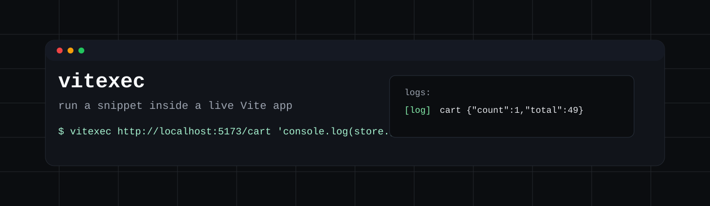

<div align="center">
  
</div>

## Quickstart

Install the skill:

```sh
npx skills add drawcall-ai/vitexec
```

Then ask your agent:

```txt
Use $vitexec to inspect the cart state after clicking add to cart.
```

You click through a checkout flow. The UI looks right. But did the client store update?

```sh
vitexec http://localhost:5173/cart '
  import { useCartStore } from "/src/stores/cart.ts";

  document.querySelector("[data-testid=add-to-cart]")?.click();
  await new Promise((resolve) => requestAnimationFrame(resolve));

  const { items, total } = useCartStore.getState();
  console.log("cart", JSON.stringify({ count: items.length, total }));
'
```

```txt
logs:
[log] cart {"count":1,"total":49}
```

No temporary test page. No debug panel. No guessing from the DOM.

## Use It For

- Reading Zustand, Redux, or app state after user interactions
- Inspecting exported objects from the Vite module graph
- Checking canvas, WebGL, and Three.js scenes in the browser
- Capturing screenshots from a live page
- Turning vague browser failures into readable logs

## Commands

Run a snippet:

```sh
vitexec http://localhost:5173/ 'console.log("ready")'
```

Capture the page:

```sh
vitexec --screenshot ./artifacts/cart.png http://localhost:5173/cart '
  console.log("captured");
'
```

Use GPU mode for canvas-heavy checks:

```sh
vitexec --gpu http://localhost:5173/ '
  console.log("webgl", Boolean(document.createElement("canvas").getContext("webgl")));
'
```

The skill explains when to use `vitexec`, how to install it if missing, how to add the plugin, and how to write focused snippets that return useful logs.
