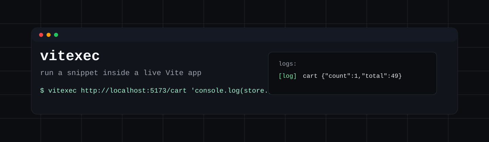

<div align="center">
  
</div>

Give AI agents a fast way to test Vite apps from the inside: inspect runtime state,
drive interactions, and capture screenshots, recordings, or performance data.

From your Vite app, install vitexec and run a check:

```sh
pnpm add -D vitexec
pnpm exec vitexec 'console.log(document.title)'
```

Install the agent skill:

```sh
npx skills add drawcall-ai/vitexec
```

See the [skill](./packages/vitexec/skills/vitexec/SKILL.md) for detailed usage.
